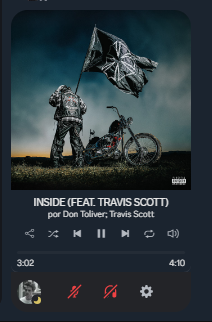

# AquaWave Theme

AquaWave é um tema vibrante e moderno para Discord, inspirado nas cores refrescantes do oceano. Com um gradiente suave que transita entre tons de verde e azul, este tema proporciona uma experiência visual relaxante e envolvente. As bordas arredondadas e os ícones personalizados adicionam um toque de elegância, enquanto a paleta de cores cuidadosamente escolhida garante que cada elemento se destaque de forma harmoniosa. Ideal para quem busca um ambiente de chat que seja tanto funcional quanto esteticamente agradável.

## Recursos

- Gradiente de fundo suave em tons de verde e azul
- Bordas arredondadas para uma aparência moderna
- Todos os ícones do Discord foram alterados
- Várias animações suaves adicionadas para transições e interações mais fluídas
- Correção de bugs na interface do usuário
- Estilo responsivo e agradável aos olhos

## Instalação

1. **Instale o BetterDiscord**: Se você ainda não tem o BetterDiscord instalado, siga as instruções no [site oficial](https://betterdiscord.app/).

2. **Baixe o Tema**: Vá para a seção de [Releases](https://github.com/akiradv/Aqua-Wave/releases) deste repositório e baixe a versão mais recente.

3. **Adicione o Tema ao BetterDiscord**:
   - Navegue até a pasta de temas do BetterDiscord. Normalmente, ela está localizada em:
     - Windows: `%appdata%/BetterDiscord/themes`
     - macOS: `~/Library/Application Support/BetterDiscord/themes`
   - Mova o arquivo do tema para essa pasta.

4. **Ative o Tema**:
   - Abra o Discord e vá para as configurações do BetterDiscord.
   - Na seção "Temas", ative o AquaWave.

## Contribuição

Contribuições são bem-vindas! Se você tiver sugestões ou melhorias, sinta-se à vontade para abrir uma issue ou enviar um pull request.

## Suporte

## Licença

Este projeto está licenciado sob a [MIT License](LICENSE). Você pode usar, modificar e distribuir este tema como desejar.

## Agradecimentos

Agradecimentos especiais ao repositório [Midnight Discord](https://github.com/refact0r/midnight-discord) pelas bordas melhoradas de servidor e por corrigir uma tonelada de bugs na interface do usuário. Também agradecemos ao tema [GlassWave](https://github.com/Elisniper/Glass-Wave) pelas inspirações nas animações suaves que foram integradas ao AquaWave.
